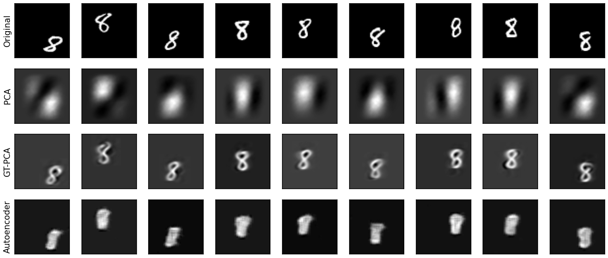

# GT-PCA: General Transform-Invariant Principal Component Analysis

This repository contains code that implements the methodology proposed in 
"GT-PCA: Effective and Interpretable Dimensionality Reduction with General
Transform-Invariant Principal Component Analysis". 

The core functions are in pc_layer.py (GTPCA_Layer, add_principal_component and 
full_embedding):
- GTPCA_Layer contains logic to create a single transform-invariant component
- add_principal_component() adds successively layers/components to the model
- full_embedding() creates a model to project the data into a low-dimensional 
space and possibly back to the original space

An exemplary use of these functions is provided in example.py, where also 
alternative models are trained. Resulting projections are visualized after 
training, see the following figures (reconstructions based on 4 components):

